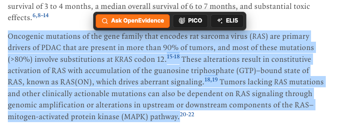

[](https://github.com/htlin222/oe-extension/actions/workflows/release.yml)
[](https://github.com/htlin222/oe-extension/releases)
[](LICENSE)
[](manifest.json)
[](package.json)
[](https://github.com/htlin222/oe-extension/stargazers)

# OpenEvidence Selection Opener

OpenEvidence Selection Opener is a lightweight Chrome extension for clinicians,
students, and evidence-based medicine readers. Select text on a whitelisted page,
click `Ask OpenEvidence`, and the extension opens the selection in OpenEvidence
right next to the current tab. With a validated Groq API key, it can also rewrite
selected recall-style text into editable foreground questions before sending them
to OpenEvidence.



## Features

- Selection toolbar anchored above highlighted text.
- `UpToDate` and `Google` buttons to search the selection beside the current tab.
- Right-click `Ask OpenEvidence` context menu for pages and Chrome PDF selection fallback.
- Opens OpenEvidence beside the current tab, optionally in the background.
- Local query history with a dedicated options tab, recording each text sent to OpenEvidence (plus the original selection, prompt, and transformed text for `PICO`/custom rewrites).
- Whitelist-based activation, including `file:///*` support.
- BYOK Groq integration stored in `chrome.storage.local`.
- Built-in `PICO` rewrite flow for evidence-based medicine questions.
- Custom prompt buttons with user-defined names and prompt instructions.
- Editable LLM output panel with `Copy`, `Ask OpenEvidence`, and `Close`.
- Light, dark, or system appearance modes.
- No runtime framework, no remote UI dependencies.

## Default Whitelist

```text
https://ankiuser.net/study
https://www.openevidence.com/*
http://uptodate.com/*
nejm.org/*
file:///*
```

Entries are URL prefixes. `*` can be used as a wildcard.

## Install From Release

1. Download the latest `oe-extension-vX.Y.Z.zip` from [Releases](https://github.com/htlin222/oe-extension/releases).
2. Unzip it.
3. Open `chrome://extensions`.
4. Enable Developer mode.
5. Click `Load unpacked`.
6. Select the unzipped extension folder.

The release also includes a `.crx` artifact generated by GitHub Actions.

## Install From Source

```bash
git clone https://github.com/htlin222/oe-extension.git
cd oe-extension
npm test
npm run build
```

Then load `dist/extension` from `chrome://extensions`.

## Local PDF Support

For local PDF files opened in Chrome:

1. Open `chrome://extensions`.
2. Open this extension's details.
3. Enable `Allow access to file URLs`.

Chrome's built-in PDF viewer may not expose selection events to content scripts.
When the floating toolbar does not appear, use the right-click context menu:
select text, right click, choose `Ask OpenEvidence`.

## Groq BYOK

The `PICO` and custom prompt buttons appear only after a Groq API key is validated.

1. Open extension options.
2. Under `PICO rewrite`, click `Edit`.
3. Paste a Groq API key.
4. Click `Save`.

The key is stored locally with `chrome.storage.local`; it is not committed,
bundled, or sent anywhere except Groq API requests initiated by the extension.

## Custom Prompts

Custom prompts let you create extra buttons beside `Ask OpenEvidence` and `PICO`.
Each custom prompt has:

- a button name, such as `Dx`, `Summarize`, or `Guideline`;
- a prompt that tells Groq how to transform the selected text.

The model output is displayed in an editable panel. You can copy it or ask
OpenEvidence with the edited result.

## OpenEvidence URL

The extension opens selections with this URL shape:

```text
https://www.openevidence.com/ask?query=<selected text>&configName=prod&attachments=%5B%5D&_rsc=1pln2
```

## Release Workflow

Release packaging runs on GitHub release creation/publication:

- runs the test suite;
- builds `dist/oe-extension-v<version>.zip`;
- packs `dist/oe-extension-v<version>.crx`;
- uploads both files as release artifacts.

For stable CRX IDs across releases, add a repository secret named
`CRX_PRIVATE_KEY_BASE64` containing the base64-encoded Chrome extension private
key. Without that secret, CI still generates a `.crx`, but Chrome may assign a
new extension ID.

## Development

```bash
npm test
npm run build
```

The project is intentionally plain Manifest V3 JavaScript, CSS, and HTML.

## Citation

If you use this project, please cite it:

```bibtex
@software{lin2026oeextension,
  author = {Lin, Hsieh-Ting},
  title = {oe-extension: OpenEvidence selection helper for Chrome},
  year = {2026},
  url = {https://github.com/htlin222/oe-extension},
  version = {0.1.2}
}
```

## License

This project is licensed under the [MIT License](LICENSE).
